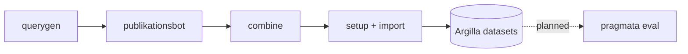

# pragmata-workspace

Operational glue for running the [pragmata](https://github.com/) annotation pipeline against
the BSt (Bertelsmann Stiftung) publikationsbot. Holds **scripts, configs, and specs** that
are specific to the BSt operational setup and deliberately do not belong in `pragmata`
itself. It does **not** hold data or outputs (those stay local and gitignored, see
[Data & secrets](docs/configuration.md#data--secrets)).



## Setup

Clone, then:

1. `cp .env.example .env` and fill in the keys (Argilla, LLM, publikationsbot,
   `PRAGMATA_SRC`). See [Configuration](docs/configuration.md).
2. `cp configs/annotation/users.json.example configs/annotation/users.json` and
   `cp configs/annotation/users.secrets.json.example configs/annotation/users.secrets.json`,
   then fill in the real roster + passwords. Both stay gitignored. See
   [Annotator roster](docs/configuration.md#annotator-roster).
3. Point `PRAGMATA_SRC` at a `pragmata` checkout (provides the `pragmata` CLI) and create the
   `.venv/` it expects.
4. `make help` lists the targets; preview a run with `bash scripts/pipeline.sh --dry-run`.

Data, logs, reports and Argilla backups are **not** committed — see
[Data & secrets](docs/configuration.md#data--secrets) and
[Reproducibility](docs/reproducibility.md).

## Make targets

`make help` prints this list. Every target is a thin wrapper over `scripts/` (each stays
runnable directly), taking `VAR=value` overrides.

```
# Pipeline  (querygen -> bot -> combine -> setup -> import)
make pipeline       # run a slice: FROM= TO= ONLY= FILTER= JOBS=   (no args = full run)
make querygen       # generate synthetic queries             (SPECS=a,b to filter)
make bot            # run publikationsbot over the queries    (SPEC=x to filter)
make combine        # pool runs + intersperse edgecases       (DOMAINS="a b")
make setup          # provision Argilla workspaces + users    (DOMAIN= required)
make import         # import one domain's combined JSONL       (DOMAIN= required)

# Annotation ops
make export         # export annotations to per-task CSVs      (DOMAIN= to filter)
make log            # append an annotation snapshot to logs/annotation/log.jsonl
make report         # render latest snapshot -> reports/annotation/<date>/ (+ plots)
make report-tables  # render tables only -> report.md
make report-pdf     # render tables -> report.pdf              (needs pandoc + xelatex)
make plots          # render plots only, PNGs                  (needs matplotlib)
make daily          # nightly logging: export -> log.jsonl
make backup         # status-preserving Argilla backup         (ARGS="restore <dir>")
make reproduce-curation  # rebuild the 2026-07-01 curated set  (MODE= APPLY=)

# Eval data transport  (see docs/eval-data-transport.md)
make eval-push      # push a tree to the eval Blob             (DIR= PREFIX= have defaults)
make eval-pull      # pull blob <prefix>/ -> data/transfer/<prefix>/ + verify (PREFIX=)
make eval-verify    # re-verify a pulled tree against its manifest (PREFIX=)

make help           # list every target
```

## Documentation

- [Annotation pipeline](docs/annotation.md) — build flow, orchestrator, logging/reporting,
  backup/restore.
- [Eval pipeline](docs/eval.md) - sibling pipeline; data transport has shipped, the
  train/predict/score stages are still to build.
- [Eval data transport](docs/eval-data-transport.md) - moving exports, predictions and
  checkpoints between the CPU annotation box and the GPU eval box over Azure Blob.
- [Reproducibility](docs/reproducibility.md) — dated lineage bundles + `reproduce-curation`.
- [Configuration](docs/configuration.md) — secrets, tunables, annotator roster, data &
  secrets.

## Layout

```
.env.example           template for .env (copy to .env and fill in)
configs/               committed configs & specs (settings.conf, annotation/, eval/ stub)
reproducibility/       committed lineage records (one dated bundle per operation)
scripts/               committed pipeline code (pipeline.sh, daily.sh, annotation/, lib/, eval/ stub)
data/  logs/  reports/ pipeline I/O and outputs (gitignored except README + .gitkeep)
argilla_backup/        status-preserving Argilla dumps (gitignored, local/external)
tmp/                   one-off local scratch (gitignored)
```

Each top-level directory has its own README with the detail. All scripts share conventions
via `scripts/lib/` (workspace-root resolution, `.env` + `configs/settings.conf` loading,
stderr logging, disk/env guards) — see `scripts/lib/common.sh` (shell) and
`scripts/lib/workspace.py` (python).
