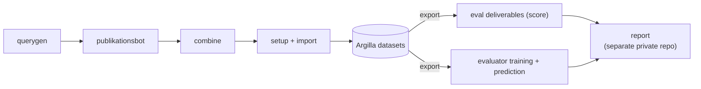

# pragmata-workspace

Operational glue for running the [pragmata](https://github.com/bertelsmannstift/pragmata) annotation pipeline against the BSt (Bertelsmann Stiftung) publikationsbot.

Holds scripts, configs, and specs that are specific to the BSt operational setup. It does **not** hold data, logs or outputs (those stay local and gitignored, see [Data & secrets](docs/configuration.md#data--secrets)). The final report is assembled from the scored deliverables and the evaluator's predictions in a separate private repository.

**High level pipeline:**

```mermaid
flowchart LR
  qg[querygen] --> bot[publikationsbot] --> comb[combine] --> imp["setup + import"] --> arg[(Argilla datasets)]
  arg -->|export| ev["eval deliverables (score)"]
  arg -->|export| tr["evaluator training + prediction"]
  ev --> rep["report<br/>(separate private repo)"]
  tr --> rep
```

> **Start here: [Implementation Guide](docs/IMPLEMENTATION-GUIDE.md)**.

## Setup

Clone, install [uv](https://docs.astral.sh/uv/getting-started/installation/), then `make venv-setup` and fill in the local configuration. The full procedure is in the [implementation guide §3](docs/IMPLEMENTATION-GUIDE.md#3-prepare-the-repositories-and-configuration); variable definitions and file formats are in [Configuration](docs/configuration.md); and the pilot's own identifiers and env values are in the git-excluded `docs/deployment-inventory.local.md`.

## Make targets

`make help` prints this list. Every target is a thin wrapper over `scripts/` (each stays runnable directly), taking `VAR=value` overrides.

```
# Dataset build pipeline  
make pipeline                  # run a slice: FROM= TO= ONLY= FILTER= JOBS=  (no args = full run)
make plan                      # preview a slice without running it  (same vars as pipeline)
make querygen-run              # generate synthetic queries          (SPECS=a,b to filter)
make bot-run                   # query publikationsbot for answers   (SPEC=x to filter)
make bot-probe                 # one-query bot smoke test, writes no JSONL
make combine-run               # assemble the import-ready dataset   (DOMAINS="a b")

# Annotation ops
make annotation-setup          # provision Argilla workspaces + users (DOMAIN= required)
make annotation-import         # load one domain's dataset into Argilla (DOMAIN= required)
make annotation-export         # export annotations to per-task CSVs (DOMAIN= to filter)
make annotation-log            # append a snapshot to logs/annotation/log.jsonl
make annotation-snapshot       # export + log one snapshot (what the cron runs)
make annotation-freeze         # archive the export tree + pin it for the eval reports (DATE= RUN_AT= optional, derived)
make annotation-backup         # status-preserving Argilla backup (dump)
make annotation-restore        # restore a backup   (DIR= required; previews unless APPLY=1)

# Annotation reporting  (-> reports/annotation/<date>/)
make annotation-report         # tables + plots, and repoint _latest
make annotation-report-tables  # tables only -> report.md
make annotation-report-pdf     # tables -> report.pdf                (needs pandoc + xelatex)
make annotation-report-plots   # plots only, PNGs                    (needs matplotlib)

# Eval deliverables  (-> reports/eval/<date>/, OUT= to redirect; see docs/report-deliverables.md)
make eval-annotation-tables    # annotation_operations, annotation_label_summary
make eval-retrieval-manifest   # retrieval_manifest.csv, the fairness audit's join key
make eval-score-human          # eval_metric_estimates.csv, via `pragmata eval score`
make eval-catalog              # corpus_catalog.csv from the publikationsbot vector store (az login)
make eval-deliverables         # all seven deliverable targets, including the model side below

# Synthetic evaluators  (train + apply; GPU host - see docs/synthetic-evaluators.md)
make eval-train-inputs         # pool the frozen export per task -> data/eval-inputs/training/
make eval-train-seqlen         # diagnostic: sequence-length truncation per task
make eval-train                # train one evaluator (TASK= required; grounding is 2+ hours)
make eval-predict-inputs       # stage the unlabelled side  (POPULATION=annotated|corpus)
make eval-predict              # apply one evaluator (TASK= POPULATION= RUN_ID= BATCH_SIZE=)
make eval-score-synthetic      # synthetic_metric_estimates.<population>.csv (POPULATION=)
make eval-model-metrics        # evaluator_metrics.csv                        (CPU-only)
make eval-model-calibration    # evaluator_calibration.csv                    (GPU host)

# Data transport  (see docs/data-transport.md)
make transfer-push             # push a tree to the Blob             (SRC= source, PREFIX= dest; both required)
make transfer-pull             # pull blob <prefix>/ -> data/transfer/<prefix>/ + verify (PREFIX=)
make transfer-verify           # re-verify a pulled tree against its manifest (PREFIX=)

# Reproducibility  (dated bundles under reproducibility/)
make repro-verify              # check every bundle's pins            (PIN= for one)
make repro-pin                 # start a new dated bundle            (NAME= PATHS= required)
make repro-reproduce           # replay a lineage bundle              (PIN= required, MODE= APPLY=)

make docs-check                # this list matches the Makefile + every doc link resolves
make help                      # list every target
```

`make docs-check` is what keeps the list above honest: it compares the target names here against the Makefile's own `##` help lines in both directions, so neither an undocumented target nor a stale line here can pass. It also checks every relative doc link and `#heading` anchor.

## Documentation

> **[IMPLEMENTATION GUIDE](docs/IMPLEMENTATION-GUIDE.md)** - the end-to-end handover walkthrough: produce, annotate and evaluate a new dataset from a fresh machine/RAG system. Everything below is reference detail it cross-references.

- [Annotation pipeline](docs/annotation.md) - build flow, orchestrator, logging/reporting, backup/restore.
- [Report deliverables](docs/report-deliverables.md) - the report deliverables, the three pins behind every number, the `data/eval/` ownership rule, and the runbook for cutting a new freeze.
- [Synthetic evaluators](docs/synthetic-evaluators.md) - training the evaluators and applying them: the GPU environment, the recommended config per task, the two predicted populations, and what their numbers may and may not be read as.
- [Data dictionary](docs/data-dictionary.md) - every column of every delivered CSV, and the caveats on reading them. Injected into each deliverable by hash.
- [Data transport](docs/data-transport.md) - moving exports, the curated corpus, predictions and checkpoints between the CPU annotation box and the GPU eval box over Azure Blob.
- [Reproducibility](docs/reproducibility.md) - the dated bundle convention + the `repro-*` targets.
- [Configuration](docs/configuration.md) - every config file and env var, the freeze pin, the domain config, and what stays gitignored.

## Layout

```
.env.example           template for .env (copy to .env and fill in)
configs/               committed configs & specs (settings.conf, annotation/, eval/ stub)
reproducibility/       committed lineage records (one dated bundle per operation)
scripts/               committed pipeline code (pipeline.sh, daily.sh, annotation/, eval/, lib/, transfer/)
data/  logs/  reports/ pipeline I/O and outputs (gitignored except README + .gitkeep)
argilla_backup/        status-preserving Argilla dumps (gitignored, local/external)
docs/
```
