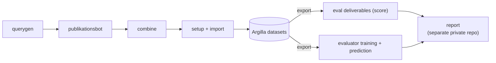

# pragmata-workspace

Operational glue for running the [pragmata](https://github.com/bertelsmannstift/pragmata) annotation pipeline against
the BSt (Bertelsmann Stiftung) publikationsbot. Holds scripts, configs, and specs that
are specific to the BSt operational setup and deliberately do not belong in `pragmata`
itself. It does **not** hold data or outputs (those stay local and gitignored, see
[Data & secrets](docs/configuration.md#data--secrets)).


```mermaid
flowchart LR
  qg[querygen] --> bot[publikationsbot] --> comb[combine] --> imp["setup + import"] --> arg[(Argilla datasets)]
  arg -->|export| ev["eval deliverables (score)"]
  arg -->|export| tr["evaluator training + prediction"]
  ev --> rep["report<br/>(separate private repo)"]
  tr --> rep
```

Training and prediction live in `pragmata`
(`pragmata eval train-evaluator|predict-labels`, `tlmtc`-backed) and run on the GPU box; what
is still open there is the *project-side* procedure - the commit, config files and accepted
commands - see
[implementation guide §10](docs/implementation-guide.md#10-run-the-evaluation). The final
report is assembled from the scored deliverables and the evaluator's predictions in a
separate private repository, outside this workspace.

> **Start here: the [IMPLEMENTATION GUIDE](docs/implementation-guide.md).** It walks the whole
> pipeline end to end - produce, annotate and evaluate a dataset from a fresh machine - and
> cross-references out to the topic docs for detail. The rest of this README is reference for
> readers who already know the shape of the pipeline.

## Setup

Clone, install [uv](https://docs.astral.sh/uv/getting-started/installation/), then
`make setup` and fill in the local configuration. The full procedure is
[implementation guide §3](docs/implementation-guide.md#3-prepare-the-repositories-and-configuration);
variable definitions and file formats are in [Configuration](docs/configuration.md); and the
pilot's own identifiers and env values are in the git-excluded
`docs/deployment-inventory.local.md`.

Then `make help` lists the targets; preview a run with `make plan`.

Data, logs, reports and Argilla backups are **not** committed - see
[Data & secrets](docs/configuration.md#data--secrets) and
[Reproducibility](docs/reproducibility.md).

## Make targets

`make help` prints this list. Every target is a thin wrapper over `scripts/` (each stays
runnable directly), taking `VAR=value` overrides.

```
# Dataset build pipeline  (ends at the Argilla import)
make pipeline                  # run a slice: FROM= TO= ONLY= FILTER= JOBS=  (no args = full run)
make plan                      # preview a slice without running it  (same vars as pipeline)
make querygen-run              # generate synthetic queries          (SPECS=a,b to filter)
make bot-run                   # query publikationsbot for answers   (SPEC=x to filter)
make bot-probe                 # one-query bot smoke test, writes no JSONL
make combine-run               # assemble the import-ready dataset   (DOMAINS="a b")
make annotation-setup          # provision Argilla workspaces + users (DOMAIN= required)
make annotation-import         # load one domain's dataset into Argilla (DOMAIN= required)

# Annotation ops
make annotation-export         # export annotations to per-task CSVs (DOMAIN= to filter)
make annotation-log            # append a snapshot to logs/annotation/log.jsonl
make annotation-daily          # nightly logging: export -> log.jsonl
make annotation-freeze         # archive the export tree + pin it for the eval reports (DATE= RUN_AT= optional, derived)
make annotation-backup         # status-preserving Argilla backup (dump)
make annotation-restore        # restore a backup   (DIR= required; previews unless APPLY=1)

# Annotation reporting  (-> reports/annotation/<date>/)
make annotation-report         # tables + plots, and repoint _latest
make annotation-report-tables  # tables only -> report.md
make annotation-report-pdf     # tables -> report.pdf                (needs pandoc + xelatex)
make annotation-report-plots   # plots only, PNGs                    (needs matplotlib)

# Eval deliverables  (-> reports/eval/<date>/, OUT= to redirect; see docs/eval.md)
make eval-report               # annotation_operations, annotation_label_summary, retrieval_manifest
make eval-score                # eval_metric_estimates.csv, via `pragmata eval score`
make eval-catalog              # corpus_catalog.csv from the publikationsbot vector store (az login)

# Data transport  (see docs/eval-data-transport.md)
make transfer-push             # push a tree to the Blob             (SRC= source, PREFIX= dest; both required)
make transfer-pull             # pull blob <prefix>/ -> data/transfer/<prefix>/ + verify (PREFIX=)
make transfer-verify           # re-verify a pulled tree against its manifest (PREFIX=)

# Reproducibility  (dated bundles under reproducibility/)
make repro-verify              # check every bundle's pins            (PIN= for one)
make repro-pin                 # start a new dated bundle            (NAME= PATHS= required)
make repro-reproduce           # replay a lineage bundle              (PIN= required, MODE= APPLY=)

make help                      # list every target
```

## Documentation

- **[IMPLEMENTATION GUIDE](docs/implementation-guide.md) - start here.** The end-to-end
  handover walkthrough: produce, annotate and evaluate a new dataset from a fresh machine.
  Everything below is reference detail it cross-references.
- [Annotation pipeline](docs/annotation.md) - build flow, orchestrator, logging/reporting,
  backup/restore.
- [Eval pipeline](docs/eval.md) - deliverables, the pinned freeze model, annotator
  pseudonymisation, and the refresh runbook; train/predict have no workspace glue yet.
- [Eval data transport](docs/eval-data-transport.md) - moving exports, predictions and
  checkpoints between the CPU annotation box and the GPU eval box over Azure Blob.
- [Reproducibility](docs/reproducibility.md) - the dated bundle convention + the `repro-*` targets.
- [Configuration](docs/configuration.md) - secrets, tunables, annotator roster, data &
  secrets.

## Layout

```
.env.example           template for .env (copy to .env and fill in)
configs/               committed configs & specs (settings.conf, annotation/, eval/ stub)
reproducibility/       committed lineage records (one dated bundle per operation)
scripts/               committed pipeline code (pipeline.sh, daily.sh, annotation/, eval/, lib/, transfer/)
data/  logs/  reports/ pipeline I/O and outputs (gitignored except README + .gitkeep)
argilla_backup/        status-preserving Argilla dumps (gitignored, local/external)
tmp/                   one-off local scratch (gitignored)
```

Each top-level directory has its own README with the detail. All scripts share conventions
via `scripts/lib/` (workspace-root resolution, `.env` + `configs/settings.conf` loading,
stderr logging, disk/env guards) - see `scripts/lib/common.sh` (shell) and
`scripts/lib/workspace.py` (python).
