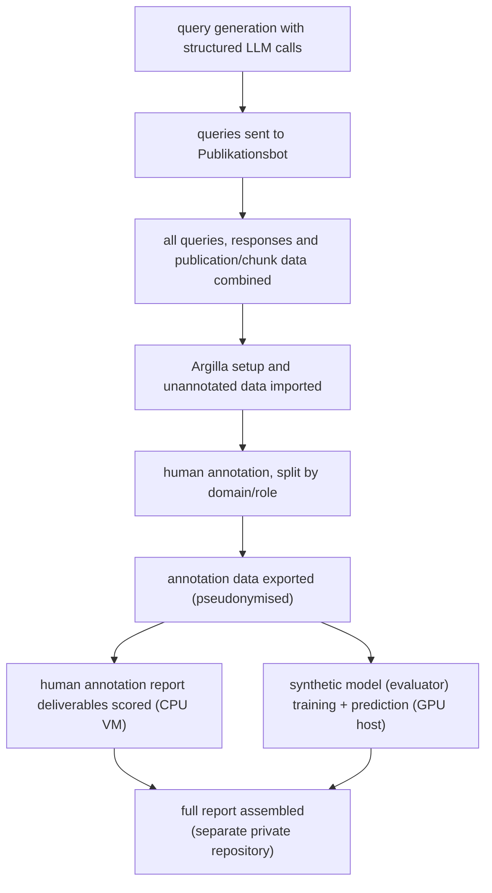
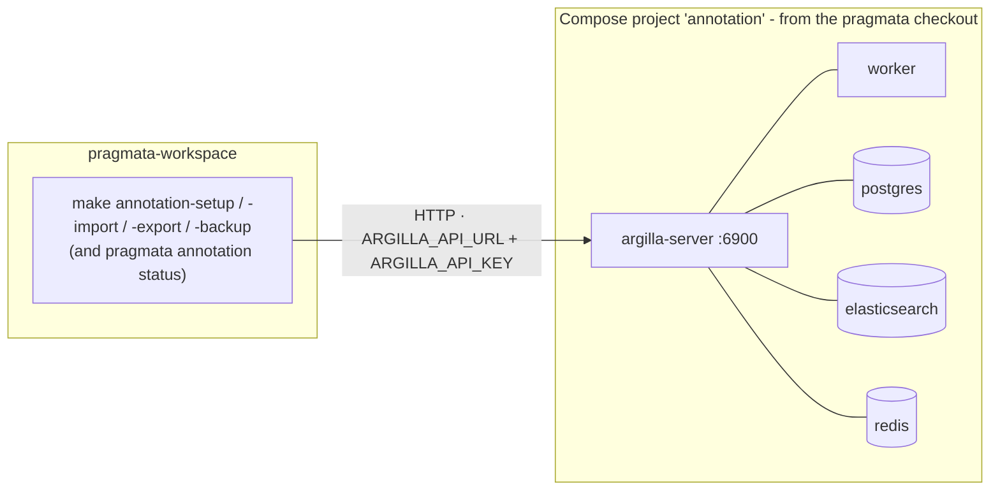
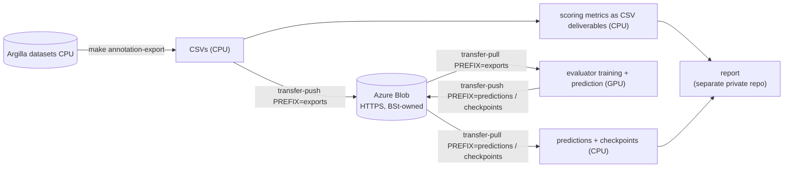

# pRAGmata IMPLEMENTATION GUIDE (Bertelsmann Stiftung)

## 1. Purpose

How to run the full pRAGmata pipeline (produce, annotate and evaluate a new RAG system dataset) end to end. This is the handover counterpart to the per-topic docs: it walks the whole pipeline and cross references out for detail. 

Two repositories are used:

- [`pragmata-workspace`](https://github.com/hertie-data-science-lab/pragmata-workspace) - the BSt project-specific configurations and scripts that connect the pipeline stages.
- [`pragmata`](https://github.com/bertelsmannstift/pragmata) - the Python package those scripts call.

Additionally, access to `Publikationsbot` within the Bertelsmann network is required to generate the query-response dataset.

The process is:



NB: the synthetic evaluator fine-tuning and prediction are implemented in `pragmata` (`pragmata eval train-evaluator|predict-labels`, backed by `tlmtc`); assembling the final report happens in a separate repository and is out of scope here.

## 2. How the system is arranged

The documented setup uses instances of the same `pragmata-workspace` repository implemented across two machines:

1. a **CPU annotation VM** in the Bertelsmann Stiftung Azure tenant; and
2. a **GPU evaluation container** in the Hertie network - a shared bare-metal server running Docker containers(selected for expediency; there's no constraint against both machines being run within the same network).

The CPU VM runs the dataset-generation and annotation pipeline (Azure OpenAI, Publikationsbot, Argilla), exports and pseudonymises the annotations, scores the human labels into report CSVs, and pushes exports to Azure Blob Storage. The GPU host downloads the exports from the Blob Storage, runs containerised evaluator training (fine-tuning of a Hugging Face model) and prediction, and returns predictions and checkpoints (from which they are then pulled back into the CPU VM).

The two boxes do not connect directly. Code moves through GitHub (both instances need to be at the same commit); data moves through Azure Blob Storage over HTTPS. See [Data transport](data-transport.md).

## 2.1 Deployment inventory

The `pragmata-workspace` repository is public, so the actual identifier values - tenant and subscription IDs, host, VM and storage-account names, the SAS expiry etc - are kept in a gitignored `docs/deployment-inventory.local.md`. 

| Component | Details |
| --- | --- |
| **CPU annotation VM** | Ubuntu 22.04 LTS, 4 vCPU, Sweden Central, in the Bertelsmann Stiftung tenant • Working directory: `~/pragmata-workspace` (with the eval-pin `pragmata` checkout as a sibling) • Python: 3.12.13, uv-managed, in `pragmata-workspace/.venv` via `make setup` • Access: SSH key auth as `azureuser`, password auth disabled • Tenant, subscription, resource group and VM name: recorded in the local inventory, as is the ingress path that publishes port 22 (the VM's NICs carry no public IP and no Bastion is visible in its subscription). |
| **Azure OpenAI** | Key + base URL in `.env` (`OPENAI_API_KEY`, `OPENAI_BASE_URL`); base-URL format `https://<resource>.openai.azure.com/openai/v1/` • Same tenant, subscription and resource group as the CPU VM; resource and deployment names in the local inventory, the deployment matching the model named in `querygen_specs/_runtime.yaml`.|
| **Publikationsbot** | Service URL in `.env` (`PUBLIKATIONSBOT_URL`); the production endpoint is an Azure Container App • Auth = an Azure AD bearer, fetched with `az account get-access-token --resource https://graph.microsoft.com`. See `scripts/annotation/run_bot.py`. NB the operator needs `az login` in the tenant and an authorised account • Parallelism in use: `N_PARALLEL_BOTS=4` (`configs/settings.conf`) - more than that caused service instability. |
| **Argilla** | URL + API key in `.env` (`ARGILLA_API_URL`, `ARGILLA_API_KEY`) • Co-located on the CPU annotation VM (not separately hosted): Docker Compose (project `annotation`) from the `pragmata` checkout's `deploy/annotation/docker-compose.dev.yml`, serving port 6900, with Postgres, Redis and Elasticsearch beside it - how to bring it up is [§3.4](#34-bring-up-the-argilla-instance) • State: named Docker volumes on the VM's OS disk • Backups: `argilla_backup/<UTC-timestamp>/` in the workspace, from `make annotation-backup` • **TODO: what is the intended off-box backup destination -> volumes and backups share one OS disk today (on the VM), so when we lose the VM we will lose the annotation database, need BSt's archive process.** |
| **Azure Blob Storage** | Account/container/SAS in `.env` (`EVAL_BLOB_*`); container is private and IP-allowlisted; SAS is data-plane only, no `az login` • The SAS is container-scoped and HTTPS-only (and expires mid-2027) **TODO get details of subscription and resource group** |
| **GPU evaluation host** | A shared bare-metal GPU server in the Hertie Data Science Lab: Ubuntu 22.04.5 LTS (kernel 6.8), 4 × NVIDIA A100-PCIE-40GB, AMD EPYC 7742 (64C/128T), 503 GB RAM, 3.5 TB NVMe • Driver 535.309.01 (NB: this makes CUDA 12.2 the host ceiling). Evaluation runs in containers with runtime (`nvidia-container-toolkit` 1.19.1) • The checkout is shared between users by POSIX ACL, which is why `make setup` exists (see §3.2) |

## 3. Prepare the repositories and configuration

### 3.1 Recorded code versions

>NB: the following is for *exact* reproducibility of our pilot setup. For generally rerunning the pipeline with the pRAGmata tool to generate/annotate/evaluate new data, just `pip install pragmata` (inlcuded in `uv sync`). **TODO check i think i need to update uv later for this to work as it currently pins the annotation version?**

The pilot's specific pipeline runs two different commits of `pragmata`.

The annotation pin is a git dependency pinned to a SHA in `pragmata-workspace/pyproject.toml`, installed by `uv sync`. This commit built and imported the live Argilla instance.

The eval pin is a git checkout we provide at `pin/eval-report-2026-07` (as two commits of one package cannot be installed into the same environment). This provides the eval scoring functionality. We clone `pragmata` a second time, checkout the eval pin, and point `.env` at its `src/`. This gives:

    <working-directory>/
    ├── pragmata-eval/         # a pragmata checkout - PRAGMATA_EVAL_SRC pin (eval stage)
    └── pragmata-workspace/    # annotation pin comes from pyproject.toml, not a checkout

### 3.2 Create the environment

**On the primary CPU-backed VM**: from `pragmata-workspace` run `make setup` (requires `uv` on PATH), this creates the `.venv/`; python is also uv-managed (the version is fixed by `.python-version` (3.12.13)). As it covers every Python entry point in the repository, the single venv runs both stages ([why](report-deliverables.md#the-three-pins)). Outside Python, the scripts expect `/bin/bash`, `make`, `jq` and the Azure CLI on PATH.

> Use the target rather than a bare `uv sync`: it wraps `uv sync --frozen` and keeps uv's interpreter and wheel cache in `.uv/` in the checkout instead of `~/.local/share/uv` and `~/.cache/uv`. No practical difference on a single-user VM, but on a checkout shared between users by POSIX ACL (the GPU host) it is what makes `.venv` readable by all of them - uv writes those per-user paths mode 700/711. Both paths are overridable from the environment.

> NB: for exact pilot reproducibility, a GitHub SSH key with read access to `bertelsmannstift/pragmata` (the annotation pin is a `git+ssh://` dependency) is also required. 
> 
> Here ends the exact reproducibility divergence. The rest of the setup is is the same as if for generally re-running the pipeline.

**The GPU host does not need the venv:** everything it runs from this repository is in `scripts/transfer/sync.sh`: pull and verify are `bash` + Azure CLI + `sha256sum`, and push adds only the system `python3` for the pseudonymisation guard. 

### 3.3 Create the local configuration

From `pragmata-workspace`:

    cp .env.example .env
    cp configs/annotation/users.json.example configs/annotation/users.json
    cp configs/annotation/users.secrets.json.example configs/annotation/users.secrets.json

Complete `.env` with the values from the deployment inventory. The variable definitions and annotator-file formats are in [Configuration](configuration.md); secrets, user files, data, logs, reports and backups are gitignored.

The committed run settings live in:

- [`configs/settings.conf`](../configs/settings.conf) - operational tunables, including the querygen counts (`N_BASELINE`, `N_EDGECASE`) and the IAA bootstrap parameters
- [`configs/annotation/querygen_specs/`](../configs/annotation/querygen_specs/) - per-domain query instructions, plus `_runtime.yaml` for model/batching/timeout
- [`configs/annotation/domains/`](../configs/annotation/domains/) - the Argilla workspace/dataset structure, one YAML per domain

### 3.4 Bring up the Argilla instance

Argilla is not a hosted service in this deployment - it is a Docker Compose stack running on the CPU VM itself, and it has to be up before §5 onwards. Nothing in `pragmata-workspace` starts, stops or configures it: the workspace scripts are HTTP clients that read `ARGILLA_API_URL` and `ARGILLA_API_KEY` out of `.env` and talk to whatever is listening there.



**Where the stack comes from.** `pragmata` ships the compose file at `deploy/annotation/docker-compose.dev.yml` and drives it from its own `Makefile`. It is a deployment asset rather than pinned Python code, so the eval-pin checkout from §3.1 already carries it - no third clone is needed. Docker Compose v2.20.2+ is required. From that checkout:

    cd ../pragmata-eval
    cp deploy/annotation/.env.dev.example deploy/annotation/.env    # then edit - see below
    make docker-up        # profile all-bundled: pull, start, wait for health
    make docker-status    # every service Up / healthy
    cd -

That brings up five containers: the Argilla server (v2.8.0) on port 6900, an Argilla worker, Postgres, Elasticsearch and Redis. `--profile all-bundled` (what `make docker-up` uses) runs all three backing services locally; `make docker-up-external-pg`, `-external-es` and `docker-up-external` swap them for services you provide instead.

**Initial Credentials** `deploy/annotation/.env` sets three values the server reads on first boot:

| Variable | What it is |
| --- | --- |
| `ARGILLA_USERNAME`, `ARGILLA_PASSWORD` | the Argilla *owner* account, for browser login - the operator's, not an annotator's. Annotator accounts are created later, by `make annotation-setup` ([§7.3](#73-create-workspaces-and-users)) |
| `ARGILLA_API_KEY` | the server's bootstrap API key - and the same value the workspace `.env` must carry as `ARGILLA_API_KEY` (§3.3), because that is what `pragmata annotation setup\|import\|export\|status` authenticate with |

The shipped values are dev defaults: replace all three before the first `up` on any real deployment. The server keeps the bootstrap key it was first started with, so changing it afterwards is not a value edit - it needs the volumes destroyed and the stack rebuilt (`make docker-down-clean`, `make docker-up`. On the workspace side, set `ARGILLA_API_URL` to this stack's address: `http://localhost:6900` when the two sit on the same VM, as they do here.

**Lifecycle, and what holds the data.** State lives in named Docker volumes on the VM's OS disk - `annotation_argilladata`, `annotation_postgresdata`, `annotation_elasticdata`, `annotation_redisdata`.

| Command | Effect |
| --- | --- |
| `make docker-stop` | pause the containers without removing them |
| `make docker-down` | stop and remove the containers, **keep** the volumes - safe |
| `make docker-down-clean` | stop and **delete every volume**: the whole annotation database, irreversibly |
| `make docker-logs`, `make docker-status` | tail logs; show container health |

Those volumes *are* the annotation database, and they share one disk with the `argilla_backup/` dumps (§2.1) - so take a backup and move it off the box before anything that touches them ([§7.2](#72-back-up-argilla)).

> later we will be implementing pRAGamta native commands, including `pragmata annotation up` as the CLI verb as the eventual end-user entry point for this stack. However, for the pilot, it exists in neither pin so the compose file and the `make docker-*` targets above are the only route today.

## 4. Confirm the output tree is clean

The pipeline writes to fixed paths:

    data/querygen/runs/<specification>/
    data/publikationsbot/<specification>.jsonl
    data/publikationsbot/<domain>_combined.jsonl

They are deliberately not per-run: this makes the stages resumable (the Publikationsbot client skips query IDs already present in its output file, and the combine stage absorbs matching `_batch` files from earlier runs). An interrupted run is therefore cheap to continue - but an *earlier* run left in place is silently mixed into the new one.

Before running anything, confirm the tree is clean:

    ls data/querygen/runs        # should fail - no such directory
    ls data/publikationsbot      # should hold only .gitkeep
    make plan                    # should list the full stage sequence for every domain in scope

If an earlier run's output is still in the tree, archive and clear it first ([§11.2](#112-archive-the-completed-run)) - and do not delete an earlier run until its data, configuration, logs and checksums are archived and that archive has been verified.

## 5. Test the deployment

Everything below runs on the CPU VM unless said otherwise: §5.6 is the one check to run on **both** boxes, and §5.7 only applies to the GPU host.

### 5.1 Check local installation

    .venv/bin/python --version         # Python 3.12.13
    .venv/bin/pragmata --version       # the pinned version, and no import error
    make help
    make plan                          # preview the pipeline without running it

Only when reproducing the pilot exactly: `git -C ../pragmata-eval rev-parse --short HEAD` should print the eval-pin commit recorded in §3.1, and `ssh -T git@github.com` should greet you by username (it exits 1 even on success) - the annotation pin is a `git+ssh://` dependency, so without that key the environment cannot be built at all.

### 5.2 Test question generation

Reachability first - anything other than `200` here is a key, base-URL or network problem rather than a pipeline one:

    curl -s -o /dev/null -w '%{http_code}\n' "$OPENAI_BASE_URL/models" -H "api-key: $OPENAI_API_KEY"

Then run one domain with reduced counts (the committed defaults in `settings.conf` are production-sized):

    N_BASELINE=5 N_EDGECASE=2 make pipeline TO=querygen-run FILTER=gesundheit

Confirm the query CSVs appear under `data/querygen/runs/`.

### 5.3 Test Publikationsbot

Auth is an Azure AD bearer, so an `az login` in the tenant is a prerequisite:

    az account show --query user.name -o tsv     # your account, not "Please run 'az login'"
    make bot-probe SPEC=gesundheit               # one answer, with retrieved chunks

`bot-probe` sends one question and dumps the raw response without writing to the result JSONL. For a limited multi-question test, call the script directly with `--max-per-spec`.

### 5.4 Test the generation flow

    N_BASELINE=5 N_EDGECASE=2 make pipeline TO=combine-run FILTER=gesundheit JOBS=1

This exercises Azure OpenAI, Publikationsbot and the combine stage without touching Argilla. Review:

    logs/annotation/pipeline.log
    data/publikationsbot/*.jsonl
    data/publikationsbot/*.errors.jsonl
    data/publikationsbot/*.no_retrieval.jsonl

### 5.5 Test Argilla

The stack from [§3.4](#34-bring-up-the-argilla-instance) has to be up - `make docker-status` in the `pragmata` checkout shows it.

    .venv/bin/pragmata annotation status     # returns task table, not a connection error

A connection error means the stack is down or `ARGILLA_API_URL` does not point at it; an authentication error means `ARGILLA_API_KEY` disagrees with the key the server was bootstrapped with (§3.4).

### 5.6 Test Blob Storage

Run this on **both** boxes - it is the one dependency they share. Background on prerequisites: [Data transport](data-transport.md#one-time-setup-on-each-box).

    bash -c 'source scripts/lib/common.sh; az storage blob list \
      --account-name "$EVAL_BLOB_ACCOUNT" --container-name "$EVAL_BLOB_CONTAINER" \
      --sas-token "$EVAL_BLOB_SAS" -o table'

A listing, empty or not, is a pass. `403` means the box's egress IP is not on BSt's allowlist; a timeout means outbound 443 is blocked. No `az login` is needed - the SAS is data-plane credentials in their own right.

### 5.7 Test the GPU host

Inside the evaluation container:

    python -c "import torch; print(torch.cuda.is_available())"     # True

The driver caps the usable CUDA version (§2.1), so a `False` here is usually an image/driver mismatch rather than a missing GPU.

## 6. Generate and review the candidate dataset


The orchestrator (`scripts/pipeline.sh`) runs the five stages (querygen-run → bot-run → combine-run → annotation-setup → annotation-import) with optional stage and domain filters, a lock file, and continue-on-error with a final summary. 

`make pipeline` with no arguments runs all five stages for every domain, end to end (possible args are `FROM=`/`TO=`/`ONLY=` - same as the underlying script). 

Run query generation, Publikationsbot and combine without importing into Argilla:

    make pipeline TO=combine-run
    make pipeline TO=combine-run FILTER=gesundheit,europas-zukunft   # selected domains
    make pipeline TO=combine-run JOBS=<approved number>              # bot parallelism

The final candidate dataset per domain is `data/publikationsbot/<domain>_combined.jsonl`.

### 6.1 The import contract

`pragmata` defines the import contract as a pydantic model, `QueryResponsePair` (`src/pragmata/core/schemas/annotation_import.py`).

| Field | Rule |
| --- | --- |
| `query` | non-empty string |
| `answer` | non-empty string |
| `chunks` | at least one chunk |
| `chunks[].chunk_id`, `chunks[].doc_id` | non-empty strings |
| `chunks[].chunk_rank` | integer ≥ 1 (1-based retrieval position) |
| `chunks[].text` | non-empty string |
| `context_set` | non-empty string |
| `language` | optional; may be null. Any string is accepted - the ISO form (e.g. `"de"`) is a convention, not a validation |


The import validates every record, imports the ones that pass, and only then reports failures: `Validation errors: <n>` on stderr and exit code 1. A non-zero exit means some records are in and some are not. Fix the rejected records and re-import the whole file: record IDs are content hashes and the import is an idempotent upsert, so the already-imported records are re-written in place rather than duplicated.

## 7. Import the candidate dataset into Argilla

### 7.1 Define the workspaces & dataset shape

The workspace and dataset structure comes from `configs/annotation/domains/`, one YAML per programme. An example config, annotated:

```yaml
    # Annotation deployment config for a BSt domain (one file per domain)
    dataset_id: ""                    # suffix on the Argilla DATASET names (for pilot we left empty; use to separate runs)
    partition_scope: XYZ              # identity of the calibration/production ledger
    locale: de
    calibration_fraction: 0.2         
    calibration_max_records: 30       # absolute cap; wins over the fraction when it binds
    constraint_severity:              # per logical constraint on the labels: warn shows the
      evidence_requires_relevance: warn | block          
      evidence_excludes_misleading: warn | block         
      contradiction_requires_unsupported: warn | block   
      fabricated_requires_cited: warn | block            
    workspaces:                       # one Argilla WORKSPACE per (domain, task)
      {domain}_retrieval:             # the workspace name, used verbatim
        tasks:
          retrieval: {}               # {} = inherit the calibration settings above; per-task overrides go here
      {domain}_grounding:
        tasks:
          grounding: {}
      {domain}_generation:
        tasks:
          generation: {}
```

Argilla nests **workspace → dataset → record**, and this file fixes the first two levels:

    {domain}_retrieval                       workspace, from the `workspaces:` key
      ├── retrieval_production               dataset
      └── retrieval_calibration              dataset

Both dataset names are unconditional - a task always gets both - so a zero `calibration_fraction` gives an empty calibration dataset rather than none.

To add further future runs, use **`dataset_id`**. When empty (as in every shipped pilot domain) the datasets are named `retrieval_production` and `retrieval_calibration`, so a second import lands in the *same* datasets as the last run. Set it - `dataset_id: "2026-08"` - and the same import creates `retrieval_production_2026-08` beside the old ones.

One workspace per task, and the annotation item differs by task. Grounding and generation have one item per record; retrieval has one per (record, chunk). That is why panels exist for retrieval alone, and why `panel_complete` is a retrieval-only condition (§8.1).

### 7.2 Back up Argilla

    make annotation-backup

Backup and restore are documented in [Annotation pipeline](annotation.md#backup--restore). Take a new backup before importing into an instance that holds existing records.

### 7.3 Create workspaces and users

    make annotation-setup DOMAIN=gesundheit    # one domain
    make pipeline ONLY=annotation-setup        # all domains

`setup.sh` reads the domain configuration (above) and the local user files, merges the password file and calls `pragmata annotation setup`; existing users and workspaces are skipped. Auto-generated passwords print once - capture them into `users.secrets.json` ([Configuration](configuration.md#annotator-roster)).

### 7.4 Import the records

    make annotation-import DOMAIN=gesundheit   # one domain
    make pipeline FROM=annotation-setup        # all domains, after setup

After import, verify in Argilla that the expected workspaces and datasets exist (incl production and calibration for each domain), annotators have the expected access, and questions, answers and passages display correctly.

## 8. Run annotation and export the labels

The annotation rules are defined in the [pRAGmata annotation protocol](https://github.com/bertelsmannstift/pragmata/blob/main/docs/methodology/annotation-protocol.md).

Monitoring during annotation ([Annotation pipeline](annotation.md#logging--reporting)):

    make annotation-log        # append a snapshot to logs/annotation/log.jsonl
    make annotation-report     # render tables + plots for the latest snapshot
    make annotation-daily      # the nightly cron body: export -> log

### 8.1 When annotation counts as done

There is no completion target in `configs/` - `min_submitted` lives in each dataset's Argilla settings (`dataset.settings.distribution`), which `pragmata` reads live. Read it with:

    .venv/bin/pragmata annotation status                    # all tasks, all workspaces
    .venv/bin/pragmata annotation status --by-dataset       # per dataset

Two conditions, both required:

- **`overlap_satisfied`** (operational) - every item has at least `min_submitted` submitted responses, per its own dataset's setting (default 1 for production, 3 for calibration). This is what makes Inter Annotator Agreement computable, and it is the sense in which Argilla itself calls a record "completed".
- **`panel_complete`** (retrieval-related) - for retrieval, all K chunks of a query panel have at least one submitted response. Discards are abstentions, not judgements, so they do not count toward completeness. A panel can therefore be `panel_complete` while still overlap-unsatisfied (say 1 of 3 calibration votes in), and vice versa.

Grounding and generation are one annotation item per record, so they have no panels - the overlap condition alone applies. For retrieval, `--tag-partial-panels` stamps `needs_completion` on the unresolved chunks of partial panels so annotators can filter to them in the UI.

### 8.2 Export the annotations

    make annotation-export                      # all domains
    make annotation-export DOMAIN=gesundheit    # one domain

The export writes per-task CSVs under `data/annotation/exports/`, one directory per domain, and pseudonymises annotator identities as it runs ([Data sensitivity](data-transport.md#data-sensitivity)). Exports include discarded rows; consumers requiring completed annotations filter `response_status == "submitted"`.

    data/annotation/exports/<domain>/
    ├── retrieval.csv      
    ├── grounding.csv     
    └── generation.csv   

NB: the export tree is intended to be transient, as it is derived. The export ID is the domain, so the CSVs go to fixed paths and a later export silently replaces that domain's snapshot. Instead, the on-disk archive is the freeze:

    make annotation-freeze 

No arguments are needed: `DATE` derives from the export tree's own `created_at` (its UTC calendar date) and `RUN_AT` from the first log snapshot taken after it, since the run always exports before it logs. Override either on purpose:

    make annotation-freeze DATE=<YYYY-MM-DD> RUN_AT=<snapshot run_at>

`make annotation-freeze` copies the export tree (and the associated `logs/annotation/log.jsonl` data) from `exports` into `exports-frozen/<date>`. This gives:

    exports/<domain>/          transient, overwritten on every export, gitignored
    exports-frozen/<date>/     the archive: dated, write-protected, pushed to Blob

It then writes the pin to `configs/eval/freeze.conf` and prints the follow-ups (git commit + `make repro-pin`). The guards it applies before copying are listed in [Report deliverables](report-deliverables.md#cutting-a-new-freeze).

> NB: The freeze and the reproducibility bundle are twinned but separate artefacts. The freeze is the *bytes* - an immutable copy, not in git (`/data/` is gitignored), preserved off-box by `transfer-push`. The bundle is the *checksums* - `pins.sha256` and a README, committed, preserved by git.


## 9. Transfer the export to the GPU host

Data transfer for the pilot was handled as follows:



The Blob container (within the same Bertelsmann sub-net as the CPU VM) is the only thing both machines touch.

To transfer data securely:

On the CPU VM (human annotated data out):

    make transfer-push SRC=data/annotation/exports PREFIX=exports

On the GPU host (human annotated data in, HF model checkpoints and predictions out):

    make transfer-pull PREFIX=exports       # -> data/transfer/exports/, verified
    make transfer-verify PREFIX=exports     # re-check any time

Every push writes a SHA-256 manifest and prints a snapshot pin; every pull re-verifies on the receiving end. Full detail: [Data transport](data-transport.md).

## 10. Run the evaluation

**Scoring human-annotated labels runs on the CPU VM**. Three targets produce the report deliverables into `reports/eval/<date>/`, each CSV with a `.provenance.json` and the current data dictionary beside it:

    make eval-report     # annotation_operations, annotation_label_summary, retrieval_manifest
    make eval-score      # eval_metric_estimates.csv, via `pragmata eval score`
    make eval-catalog    # corpus_catalog.csv (needs an active `az login`)

They read pinned inputs (the `make annotation-freeze` outputs), never the live export tree. The pin model and the refresh procedure are in [Report deliverables](report-deliverables.md), and every column of every CSV is defined in the [data dictionary](data-dictionary.md).

**Evaluator training and prediction are implemented in `pragmata` and run on the GPU host.** `pragmata eval train-evaluator` fine-tunes a supervised evaluator through `tlmtc` and writes a run directory, a model directory and a run-metadata file; `pragmata eval predict-labels` applies a chosen training run to an unlabelled CSV and writes probabilities and predictions. Both live behind the `eval` extra (`pragmata[eval]` → `tlmtc[train]`), which is *not* in this workspace's lock. Instead the GPU box installs its own environment.

For training, these workspace targets carry the recommended configuration per task, pool the frozen export into the staged input, and resolve the eval pragmata pin:

    make eval-train-inputs                  # frozen export -> data/eval-inputs/training/<task>.csv
    make eval-train-seqlen                  # diagnostic: sequence-length truncation per task
    make eval-train TASK=retrieval          # then grounding (2+ hours), then generation

The per-task configurations and the install steps for the GPU host's own environment are in [Synthetic evaluators](synthetic-evaluators.md). Read it before changing any training parameter: several obvious levers were tried and made results worse.

For prediction, these targets stage the unlabelled side, apply a chosen evaluator, and turn the result into deliverables. `eval-predict` and `eval-evaluator-report PART=calibration` need the same GPU environment training does; the other three are CPU-only:

    make eval-predict-inputs POPULATION=annotated       # frozen export, labels stripped -> data/eval-inputs/predict/annotated/
    make eval-predict-inputs POPULATION=corpus          # curated corpus -> data/eval-inputs/predict/corpus/
    make eval-predict TASK=retrieval POPULATION=annotated RUN_ID=<id>
    make eval-score-synthetic POPULATION=annotated      # synthetic_metric_estimates.annotated.csv
    make eval-evaluator-report                          # evaluator_metrics.csv (PART=calibration for the other CSV)

Prediction output is filed as `data/eval/prediction_outputs/<run_id>-<population>/`, not at the `<run_id>/` tlmtc would use: tlmtc overwrites that directory without warning, so predicting a second population with the same evaluator would silently replace the first. The populations, the run order, the transport prerequisites, and what each population's numbers may and may not be read as are in [Synthetic evaluators](synthetic-evaluators.md). Read the evaluator-quality caveats there before quoting any corpus-scale synthetic number.

The final report is assembled from these outputs in a separate private repository, outside the scope of this guide.

## 11. Return and archive

### 11.1 Return the evaluation outputs

On the GPU host, upload the evaluation outputs:

    make transfer-push SRC=data/eval/prediction_outputs PREFIX=predictions
    make transfer-push SRC=data/eval/train_outputs PREFIX=checkpoints

On the CPU VM:

    make transfer-pull PREFIX=predictions
    make transfer-pull PREFIX=checkpoints

A pull lands under `data/transfer/`, which `sync.sh` enforces. Both trees have to be copied into `data/eval/prediction_outputs/` and `data/eval/train_outputs/` before they can be scored or reported on, because that is where pragmata resolves them - see [Synthetic evaluators](synthetic-evaluators.md#getting-the-data-in-and-out).

### 11.2 Archive the completed run

TBC 
