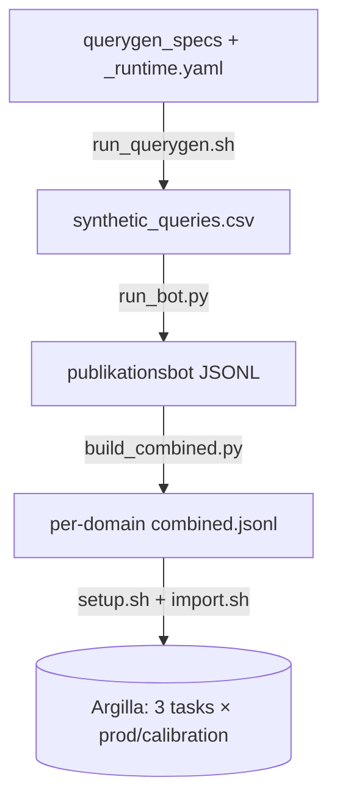

# Annotation pipeline

Generate synthetic queries, run them through the publikationsbot, and load the results
into Argilla for annotation.



Everything under `data/` is gitignored — see [Data & secrets](configuration.md#data--secrets).

## Orchestrator

`scripts/pipeline.sh` runs any contiguous slice of the stages over an optional domain
filter, owning the cross-cutting concerns the stage scripts don't: stage-aware pre-flight,
lockfile, bot parallelism, tee logging, continue-on-error.

| Invocation                   | Covers                     |
| ---------------------------- | -------------------------- |
| `pipeline.sh`                | full pipeline              |
| `pipeline.sh --to bot`       | querygen + bot             |
| `pipeline.sh --from combine` | combine + setup + import   |
| `pipeline.sh --only setup`   | provision workspaces/users |
| `pipeline.sh --only import`  | import every domain        |

`--filter` takes domains (querygen/bot expand each to `<domain>` + `<domain>_edgecase`);
`--dry-run` prints the plan without running.

`setup.sh` and `import.sh` are thin wrappers over pragmata's native `annotation setup` /
`annotation import`. The only workspace-specific bits are the password merge in `setup.sh`
(see [Annotator roster](configuration.md#annotator-roster)) and `import.sh`'s inline `jq`
projection. For anything non-standard, call the pragmata CLI directly.

## Running it

`make help` lists every target — the single stages, the orchestrated `pipeline`, and the
ops below. Each stage is a thin wrapper; read `scripts/annotation/` to see the exact native
command it runs.

```bash
make pipeline                             # full pipeline, all domains
make pipeline TO=bot FILTER=gesundheit    # querygen + bot for one domain
tmux new -s pipeline 'make pipeline'      # unattended, survives disconnect
```

## Logging & reporting

Two halves, deliberately split:

- **Logging** is automatic and daily. The nightly job — `scripts/daily.sh` (`make daily`) —
  chains `export.sh` (submitted annotations → per-domain CSVs) then `log.py --use-export`
  (live counts + IAA + cadence → append one snapshot to `logs/annotation/log.jsonl`).
- **Reporting** is manual (`make report`): render the latest snapshot into
  `reports/annotation/<date>/` — `report_tables.py` writes `report.md` (pure data tables),
  `plot_summary.py` writes the PNGs, and `_latest` is repointed to the newest.

Each snapshot carries three metrics (production vs calibration where it applies):

1. **Counts** — submitted responses (work units), completed records (met `min_submitted`),
   and total records.
2. **Calibration agreement** — per-label Krippendorff α + an n_items-weighted mean, over the
   calibration overlap.
3. **Cadence** — median seconds between consecutive submissions, per-annotator (individual
   pace) and global (team throughput). A session guard drops gaps over `LOG_SESSION_GAP_MIN`
   (default 30 min) as pauses.

Timestamps come from the REST endpoint — the SDK and export CSVs drop per-response
submission times. `log.py` emits a one-line status, not tables; pass `--summary` for an
ad-hoc table. Nightly cron:

```cron
0 2 * * * /home/azureuser/pragmata-workspace/scripts/daily.sh > /dev/null 2>&1
```

## Backup & restore

`scripts/annotation/argilla_backup.py` (`make backup`) takes a status-preserving snapshot of
**every** Argilla dataset — records, metadata, suggestions, and responses *with* their
`submitted`/`draft`/`discarded` status (the SDK's own `to_disk` drops response status).
Read-only; writes a timestamped tree under `argilla_backup/<UTC-ts>/` plus a `manifest.json`.

```bash
make backup                                             # dump all datasets
make backup ARGS="restore argilla_backup/<ts>"          # preview restore (dry-run)
make backup ARGS="restore argilla_backup/<ts> --apply"  # write it
```

`restore` reinstates the full snapshot — creating any dataset that no longer exists, and
writing onto ones that still exist. It **always previews first** (record counts, plus any
response/metadata that would change) and only writes with `--apply`. Narrow the scope with
`--workspace` / `--dataset` / `--record-id` (repeatable, AND'd), or restrict attributes with
`--only {metadata,suggestions,responses}`. Take a fresh backup before restoring onto a live
dataset — restoring reverts to that point in time, including any activity recorded after the
snapshot.
