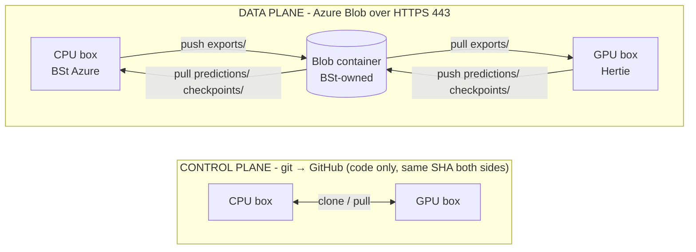

# Data transport

Moving eval data between the CPU annotation box (BSt Azure tenant) and the GPU eval box (Hertie network). Neither box can reach the other directly (BSt VNet ↔ Hertie `10.x`, no peering), so data travels through a shared Azure Blob container both reach over HTTPS.

This is the reference; the walkthrough in run order is [IMPLEMENTATION-GUIDE §9](IMPLEMENTATION-GUIDE.md#9-transfer-the-export-to-the-gpu-host) and [§11.1](IMPLEMENTATION-GUIDE.md#111-return-the-evaluation-outputs). For the staging layout see [`data/transfer/README.md`](../data/transfer/README.md).

## Two planes

- **Control plane - git.** Code moves through GitHub; both boxes must run the same commit, or the `transfer-*` targets error loudly. Nothing in `data/` is ever committed (see [Data & secrets](configuration.md#data--secrets)).
- **Data plane - Blob.** Everything else - exports, the all-generated set, predictions, checkpoints, CSV deliverables - moves as files through the container.

## The subtrees

Each is a top-level prefix, pinned by its own `MANIFEST.sha256`:

| Prefix | Direction | What |
| --- | --- | --- |
| `exports/` | CPU → GPU | annotation exports, the input to eval |
| `publikationsbot/` | CPU → GPU | the all-generated JSONLs (`*_combined.jsonl`) the `all-generated` prediction population is staged from - not part of the frozen export, so they travel separately |
| `predictions/` | GPU → CPU | the whole `data/eval/prediction_outputs/` tree, one directory per (evaluator, population) |
| `checkpoints/` | GPU → CPU | trained evaluator checkpoints - **push these off the GPU box before it is torn down** (see [Getting the data in and out](synthetic-evaluators.md#getting-the-data-in-and-out)) |

Two more prefixes sit outside the CPU ↔ GPU loop, pushed the same way: `exports-frozen/<date>/` (the pinned export tree behind published numbers) and `reports/eval/<date>/` (the CSV deliverables the final report is built from). The prefix list is not fixed: every `push` names its own.

**A pulled tree cannot always be consumed where it lands.** `pull` writes only under `data/transfer/`, never inside a tool's output tree - so a tool resetting its own directory cannot clobber received data, but `predictions/` and `checkpoints/` have to be copied into `data/eval/` after verifying, which [Getting the data in and out](synthetic-evaluators.md#getting-the-data-in-and-out) covers. The export and all-generated prefixes need none of it: the scripts that read them fall back to the `data/transfer/` copy themselves, and say which they settled on.

## Commands

`scripts/transfer/sync.sh` is the pipe; the `make` targets wrap it. All three need explicit arguments - there are no defaults.

| `make` target | `sync.sh` equivalent | Effect |
| --- | --- | --- |
| `make transfer-push SRC=<d> PREFIX=
` | `sync.sh push <d> 
` | upload tree `<d>` to `
/` + write its manifest, print a snapshot pin |
| `make transfer-pull PREFIX=
` | `sync.sh pull 
` | download `
/` into `data/transfer/
/`, then verify |
| `make transfer-verify PREFIX=
` | `sync.sh verify 
` | re-check `data/transfer/
/` against its manifest, no download |

## Integrity

Every `push` writes a sorted per-file `sha256` manifest to `<prefix>/MANIFEST.sha256` and prints a one-line snapshot pin - a single hash for the whole tree, for a future reproducibility bundle. An empty source tree is refused: a manifest of nothing pins nothing. Every `pull` re-runs `sha256sum -c` on the receiving end and fails loudly on any mismatch, so a truncated transfer cannot pass silently.

A `pull` **replaces** `data/transfer/<prefix>/` rather than downloading over the top, so a file deleted at the source cannot survive locally and pass verification - `sha256sum -c` only checks the files the manifest lists. The download lands in a staging directory and is swapped in once complete, so a failed pull leaves the previous tree intact. `verify` runs on the local tree alone: no `EVAL_BLOB_*` credentials, no `az`.

## One-time setup on each box

Neither box has to be an Azure VM. Each needs:

1. **The `az` CLI**.
2. **A `.env`** (copy `.env.example`) with the three `EVAL_BLOB_*` keys - see [Secrets](configuration.md#secrets).
3. **A clone at the same commit** as the other box.

Two network prerequisites are the usual sticking points, and matter most for the GPU box: **outbound 443 to `*.blob.core.windows.net`** must be open through the local firewall or proxy, and **the container is private and IP-allowlisted**, so the box's public egress IP must be on BSt's storage-account allowlist. Confirm the egress IP with the storage owner when onboarding a new box.

Smoke-test each box with a bare blob listing; the command is in the walkthrough at [IMPLEMENTATION-GUIDE §5.6](IMPLEMENTATION-GUIDE.md#56-test-blob-storage). `403` means the IP is not allowlisted, a timeout means 443 is blocked.

## Data sensitivity

Exports carry `annotator_id` - the annotator's Argilla user id, a UUID, rewritten from the username on every export by `scripts/annotation/pseudonymize_export.py`. `scripts/lib/check_pseudonymised.py` enforces it at both boundaries - on export, and again on push - and a username with no matching Argilla user (a renamed or deleted account) aborts the run rather than passing a real name through. As a second line of defence, `push` refuses any tree whose `annotator_id` values or `iaa/report.json` pairwise keys are not UUIDs, so a tree that skipped the rewrite cannot leave the box; trees without those surfaces (predictions, checkpoints) pass untouched.

Exports are still treated as PII: the free-text `notes` and `discard_notes` columns are annotator-authored and unreviewed. They ship into the private, IP-allowlisted container; the annotator roster (`configs/annotation/users.json`) never leaves the CPU box, and the GPU box never needs it - eval consumes label columns, not identities.
