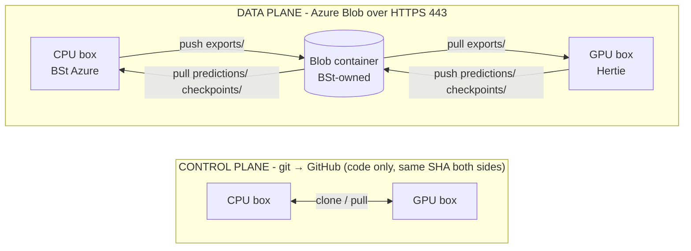

# Data transport

Moving eval data between the CPU annotation box (BSt Azure tenant) and the GPU eval box (Hertie network). The two VMs sit in different organisations and neither box can reach the other directly (BSt VNet ↔ Hertie`10.x`, no peering), so data travels through a shared Azure Blob container that both reach over HTTPS.

This is the operator how-to; for the eval stage that consumes the data see [Human annotation scoring](eval-human-annotation.md), and for the staging layout [`data/transfer/README.md`](../data/transfer/README.md).



## Two planes

- **Control plane - git.** Code moves through GitHub; both boxes must run the same commit (otherwise `transfer-*` make targets will error loudly). Nothing in `data/` is ever committed (see [Data & secrets](configuration.md#data--secrets)).
- **Data plane - Blob.** Everything else - exports, predictions, checkpoints, CSV deliverables - moves as files through the Blob container. 

## The subtrees

Each is a top-level prefix in the container, pinned by its own `MANIFEST.sha256`:

| Prefix | Direction | What |
| --- | --- | --- |
| `exports/` | CPU → GPU | annotation exports, the input to eval |
| `publikationsbot/` | CPU → GPU | the curated corpus the `corpus` prediction population is staged from - not part of the frozen export, so it travels on its own |
| `predictions/` | GPU → CPU | the whole `data/eval/prediction_outputs/` tree, one directory per (evaluator, population) |
| `checkpoints/` | GPU → CPU | trained evaluator checkpoints  |

Two further prefixes are in the container, pushed the same way but outside the CPU ↔ GPU loop: 
1. `exports-frozen/<date>/` (the pinned export tree behind published numbers),
2.  `reports/eval/<date>/` (the pipeline end CSV deliverables that form the basis of the final report).

**A pulled tree cannot always be consumed where it lands.** `pull` writes only under `data/transfer/`, while pragmata resolves evaluator runs and `--prediction-id` under `data/eval/`, so `predictions/` and `checkpoints/` have to be copied across after verifying - see [Getting the data in and out](eval-synthetic-evaluator.md#getting-the-data-in-and-out). The export and corpus prefixes need none of this: the scripts that read them fall back to the `data/transfer/` copy themselves, and say which they settled on.

## Commands

`scripts/transfer/sync.sh` is the pipe; the `make` targets wrap it with sensible defaults:

| `make` target | `sync.sh` equivalent | Effect |
| --- | --- | --- |
| `make transfer-push SRC=<d> PREFIX=<p>` | `sync.sh push <d> <p>` | upload tree `<d>` to `<p>/` + write its manifest, print a snapshot pin |
| `make transfer-pull PREFIX=<p>` | `sync.sh pull <p>` | download `<p>/` into `data/transfer/<p>/`, then verify |
| `make transfer-verify PREFIX=<p>` | `sync.sh verify <p>` | re-check `data/transfer/<p>/` against its manifest, no download |

All three require explicit arguments: 
- `transfer-push` needs `SRC=` (source tree) and `PREFIX=` (destination); 
- `pull`/`verify` need `PREFIX=`; a `pull` always lands at `data/transfer/<prefix>/` - i.e. not in the pragmata-owned tool namespaced output directories; this prevents overwriting from transfers, and means that there is no separate destination knob.

## Integrity

**When export data is frozen** (`make annotation-freeze`) this produces a hashed `sha256` pin, which is then passed through into any downstream eval ops for provenance tracking

**For data transfer**: Every `push` writes a sorted per-file `sha256` manifest to `<prefix>/MANIFEST.sha256` and prints a one-line snapshot pin (a single hash for the whole tree) for a future reproducibility bundle. An empty source tree is refused rather than pushed: a manifest of nothing pins nothing. Every `pull` re-runs `sha256sum -c` on the receiving end and fails loudly on any mismatch, so a truncated or corrupted transfer can never pass silently.

A `pull` **replaces** `data/transfer/<prefix>/` rather than downloading over the top of it, so a file deleted at the source cannot survive locally and pass verification - `sha256sum -c` only checks the files the manifest lists. The download lands in a staging directory beside it and is swapped in once complete, so a failed pull leaves the previous tree where it was. `verify` runs on the local tree alone: no `EVAL_BLOB_*` credentials, no `az`.

## The staging boundary

`sync.sh` **reads** pragmata's own tool trees (`data/annotation/`, `data/eval/`) in place and **writes only** under `data/transfer/` on the receiving box - never inside a tool's output tree. This means a tool resetting its own dir can't clobber received data. 

Eval then consumes staged input by explicit path, e.g. `pragmata eval train --labeled-data-path data/transfer/exports/<topic>/<task>.csv`.

## One-time setup on each box

The transport layer needs three things on both devices - none of them require the device to be an Azure VM:
1. **The `az` CLI.** It is a cross-platform HTTPS client, not an Azure-VM feature. 
2. **A `.env`** (copy `.env.example`) with the three `EVAL_BLOB_*` keys - see [Required keys](configuration.md). 
3. **A clone at the same commit** as the other box (the control plane).

Two network prerequisites are the usual sticking points, and matter most for the **GPU box**:

- **Outbound 443 to `*.blob.core.windows.net`** must be open through the local firewall/proxy.
- **The container is private and IP-allowlisted.** The box's public egress IP must be on BSt's storage-account allowlist, or requests return `403`. Confirm the egress IP with the storage owner when onboarding a new box.

Smoke-test a box with a bare list:

```bash
az storage blob list --account-name "$EVAL_BLOB_ACCOUNT" \
  --container-name "$EVAL_BLOB_CONTAINER" --sas-token "$EVAL_BLOB_SAS" -o table
```
`403` = IP not allowlisted; timeout = 443 blocked:

## End-to-end walkthrough

```bash
# 1. CPU box - ship the exports to the GPU box
make transfer-push SRC=data/annotation/exports PREFIX=exports    # → blob exports/

# 2. GPU box - receive + verify, then run eval by explicit path
make transfer-pull PREFIX=exports             # → data/transfer/exports/  (+verify)
pragmata eval train --labeled-data-path data/transfer/exports/<topic>/<task>.csv ...

# 3. GPU box - push the eval outputs (under data/eval/) back to the blob. Each push
#    writes its own manifest + snapshot pin - record the checkpoint pin, it is not
#    reproducible from inputs.
make transfer-push SRC=<eval-predictions-tree> PREFIX=predictions
make transfer-push SRC=<eval-checkpoints-tree> PREFIX=checkpoints   # before teardown

# 4. CPU box - collect the results and checkpoints
make transfer-pull PREFIX=predictions          # → data/transfer/predictions/  (+verify)
make transfer-pull PREFIX=checkpoints          # → data/transfer/checkpoints/   (+verify)
```

## Data sensitivity

Exports carry `annotator_id` - the annotator's Argilla user id, a UUID, rewritten from the username on every export by `scripts/annotation/pseudonymize_export.py`. The guarantee is in the code rather than in prose: `scripts/lib/check_pseudonymised.py` enforces it at both boundaries, and a username with no matching Argilla user (a renamed or deleted account) aborts the run rather than passing a real name through. As a second line of defence, `push` itself refuses any tree whose `annotator_id` values or `iaa/report.json` pairwise keys are not UUIDs, so a tree that skipped the rewrite cannot leave the box; trees without those surfaces (predictions, checkpoints) pass untouched.

Exports are still treated as PII as the free-text `notes` and `discard_notes` columns are annotator-authored and unreviewed. They
ship into the private, IP-allowlisted container; the annotator roster
(`configs/annotation/users.json`) never leaves the CPU box, and the GPU box never needs it - eval consumes label columns, not identities.