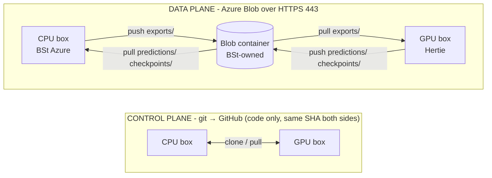

# Eval data transport

Moving eval data between the **CPU annotation box** (BSt Azure tenant) and the **GPU eval
box** (Hertie network). The two VMs sit in different organisations with no route to each
other, so data travels through a shared **Azure Blob** container that both reach over HTTPS.
This is the operator how-to; for the script internals see
[`scripts/eval/README.md`](../scripts/eval/README.md) and the staging layout in
[`data/transfer/README.md`](../data/transfer/README.md).



## Two planes

- **Control plane - git.** Code moves through GitHub; both boxes run the same commit. Nothing
  in `data/` is ever committed (see [Data & secrets](configuration.md#data--secrets)).
- **Data plane - Blob.** Everything else - exports, predictions, checkpoints - moves as files
  through the Blob container. Neither box can reach the other directly (BSt VNet ↔ Hertie
  `10.x`, no peering), but both reach Blob over HTTPS, so Blob is the pipe.

## The three subtrees

Each is a top-level prefix in the container, pinned by its own `MANIFEST.sha256`:

| Prefix | Direction | What |
| --- | --- | --- |
| `exports/` | CPU → GPU | annotation exports, the input to eval |
| `predictions/` | GPU → CPU | per-row model predictions from an eval run |
| `checkpoints/` | GPU → CPU | trained evaluator checkpoints - **pull these off before the GPU box is torn down** (everything else is reproducible from pinned inputs + code; checkpoints are expensive to regenerate) |

## Commands

`scripts/eval/sync.sh` is the pipe; the `make` targets wrap it with sensible defaults:

| `make` target | `sync.sh` equivalent | Effect |
| --- | --- | --- |
| `make eval-push` | `sync.sh push data/annotation/exports exports` | upload a tree to `<prefix>/` + write its manifest, print a snapshot pin |
| `make eval-pull PREFIX=<p>` | `sync.sh pull <p>` | download `<p>/` into `data/transfer/<p>/`, then verify |
| `make eval-verify PREFIX=<p>` | `sync.sh verify <p>` | re-check `data/transfer/<p>/` against its manifest, no download |

`push` takes `DIR=` / `PREFIX=` overrides; `pull`/`verify` require `PREFIX=`. A `pull` always
lands at `data/transfer/<prefix>/` - there is no separate destination knob.

## Integrity

Every `push` writes a sorted per-file `sha256` manifest to `<prefix>/MANIFEST.sha256` and
prints a one-line **snapshot pin** (a single hash for the whole tree) for a future
reproducibility bundle. Every `pull` re-runs `sha256sum -c` on the receiving end and fails
loudly on any mismatch, so a truncated or corrupted transfer can never pass silently.

## The staging seam

`sync.sh` **reads** pragmata's own tool trees (`data/annotation/`, `data/eval/`) in place and
**writes only** under `data/transfer/` on the receiving box - never inside a tool's output
tree. A `pull` refuses any destination that would escape `data/transfer/`. This keeps "did
pragmata produce this, or did sync drop it?" unambiguous, and means a tool resetting its own
dir can't clobber received data. Eval then consumes staged input by **explicit path**, e.g.
`pragmata eval train --labeled-data-path data/transfer/exports/<topic>/<task>.csv`.

## One-time setup on each box

The transport needs three things on **both** boxes - none of them require the box to be an
Azure VM:

1. **The `az` CLI.** It is a cross-platform HTTPS client, not an Azure-VM feature. Because we
   authenticate with a SAS token there is **no `az login`** and no Azure identity on the box.
   Install via `pip install azure-cli` (into a venv, no root needed) or the OS package.
2. **A `.env`** (copy `.env.example`) with the three `EVAL_BLOB_*` keys - see
   [Required keys](configuration.md). The real values come from the storage owner (BSt); they
   live only in the gitignored `.env`, never in git.
3. **A clone at the same commit** as the other box (the control plane).

Two network prerequisites are the usual sticking points, and matter most for the **GPU box**:

- **Outbound 443 to `*.blob.core.windows.net`** must be open through the local firewall/proxy.
- **The container is private and IP-allowlisted.** The box's public egress IP must be on
  BSt's storage-account allowlist, or requests return `403`. Confirm the egress IP with the
  storage owner when onboarding a new box.

Smoke-test a box with a bare list (clean return, even if empty, means auth + egress are good;
`403` = IP not allowlisted; timeout = 443 blocked):

```bash
az storage blob list --account-name "$EVAL_BLOB_ACCOUNT" \
  --container-name "$EVAL_BLOB_CONTAINER" --sas-token "$EVAL_BLOB_SAS" -o table
```

## End-to-end walkthrough

```bash
# 1. CPU box - ship the exports to the GPU box
make eval-push                            # data/annotation/exports → blob exports/

# 2. GPU box - receive + verify, then run eval by explicit path
make eval-pull PREFIX=exports             # → data/transfer/exports/  (+verify)
pragmata eval train --labeled-data-path data/transfer/exports/<topic>/<task>.csv ...

# 3. CPU box - collect the results and checkpoints
make eval-pull PREFIX=predictions
make eval-pull PREFIX=checkpoints         # before tearing the GPU box down
```

## Data sensitivity

Exports carry `annotator_id` - a pseudonymous, name-derived handle, not a name or email, but
treated as PII (`data/README.md` labels the exports "never commit"). They ship as-is into the
private, IP-allowlisted container; the annotator roster (`configs/annotation/users.json`)
never leaves the CPU box, and the GPU box never needs it - eval consumes label columns, not
identities.

## Not here yet

The **eval pipeline itself** (`pragmata eval train|predict|score`) is a separate effort in the
pragmata repo and is not built yet - this workspace currently ships only the transport. See
[Eval pipeline](eval.md).
