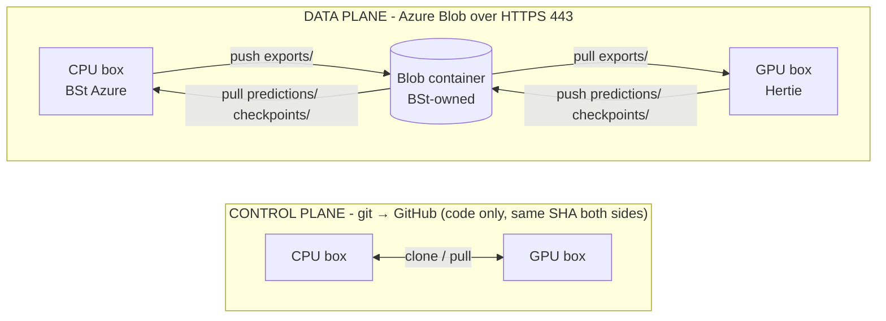

# Eval data transport

Moving eval data between the **CPU annotation box** (BSt Azure tenant) and the **GPU eval
box** (Hertie network). The two VMs sit in different organisations with no route to each
other, so data travels through a shared **Azure Blob** container that both reach over HTTPS.
This is the operator how-to; for the eval stage that consumes the data see
[Eval pipeline](eval.md), and for the staging layout
[`data/transfer/README.md`](../data/transfer/README.md).


```mermaid
flowchart LR
  subgraph control["CONTROL PLANE - git → GitHub (code only, same SHA both sides)"]
    direction LR
    cpu_code[CPU box] <-->|clone / pull| gpu_code[GPU box]
  end
  subgraph data["DATA PLANE - Azure Blob over HTTPS 443"]
    direction LR
    cpu[CPU box<br/>BSt Azure] -->|push exports/| blob[(Blob container<br/>BSt-owned)]
    blob -->|pull exports/| gpu[GPU box<br/>Hertie]
    gpu -->|push predictions/ checkpoints/| blob
    blob -->|pull predictions/ checkpoints/| cpu
  end
```

## Two planes

- **Control plane - git.** Code moves through GitHub; both boxes run the same commit. Nothing
  in `data/` is ever committed (see [Data & secrets](configuration.md#data--secrets)).
- **Data plane - Blob.** Everything else - exports, predictions, checkpoints - moves as files
  through the Blob container. Neither box can reach the other directly (BSt VNet ↔ Hertie
  `10.x`, no peering), but both reach Blob over HTTPS, so Blob is the pipe.

## The three subtrees

Each is a top-level prefix in the container, pinned by its own `MANIFEST.sha256`:

| Prefix | Direction | What |
| --- | --- | --- |
| `exports/` | CPU → GPU | annotation exports, the input to eval |
| `predictions/` | GPU → CPU | per-row model predictions from an eval run |
| `checkpoints/` | GPU → CPU | trained evaluator checkpoints - **pull these off before the GPU box is torn down** (everything else is reproducible from pinned inputs + code; checkpoints are expensive to regenerate) |

Two further prefixes are in the container, pushed the same way but outside the CPU↔GPU loop:
`exports-frozen/<date>/` (the pinned export tree behind published numbers) and
`reports/eval/<date>/` (the report deliverables). `analysis/` holds an earlier ad-hoc
IAA summary. A `push` names its own prefix, so nothing here is a fixed set - `sync.sh`
accepts any.

## Commands

`scripts/transfer/sync.sh` is the pipe; the `make` targets wrap it with sensible defaults:

| `make` target | `sync.sh` equivalent | Effect |
| --- | --- | --- |
| `make transfer-push SRC=<d> PREFIX=<p>` | `sync.sh push <d> <p>` | upload tree `<d>` to `<p>/` + write its manifest, print a snapshot pin |
| `make transfer-pull PREFIX=<p>` | `sync.sh pull <p>` | download `<p>/` into `data/transfer/<p>/` (replacing it), then verify |
| `make transfer-verify PREFIX=<p>` | `sync.sh verify <p>` | re-check `data/transfer/<p>/` against its manifest, no download |

All three require explicit arguments: `transfer-push` needs `SRC=` (source tree) and `PREFIX=`
(destination); `pull`/`verify` need `PREFIX=`. There are no defaults to override, so every
transfer names its source and destination the same way, in both directions. A `pull` always
lands at `data/transfer/<prefix>/` - there is no separate destination knob.

## Integrity

Every `push` writes a sorted per-file `sha256` manifest to `<prefix>/MANIFEST.sha256` and
prints a one-line **snapshot pin** (a single hash for the whole tree) for a future
reproducibility bundle. An empty source tree is refused rather than pushed: a manifest of
nothing pins nothing. Every `pull` re-runs `sha256sum -c` on the receiving end and fails
loudly on any mismatch, so a truncated or corrupted transfer can never pass silently.

A `pull` **replaces** `data/transfer/<prefix>/` rather than downloading over the top of it,
so a file deleted at the source cannot survive locally and pass verification — `sha256sum
-c` only checks the files the manifest lists. The download lands in a staging directory
beside it and is swapped in once complete, so a failed pull leaves the previous tree where
it was. `verify` runs on the local tree alone: no `EVAL_BLOB_*` credentials, no `az`.

## The staging boundary

`sync.sh` **reads** pragmata's own tool trees (`data/annotation/`, `data/eval/`) in place and
**writes only** under `data/transfer/` on the receiving box - never inside a tool's output
tree. A `pull` refuses any destination that would escape `data/transfer/`. This keeps "did
pragmata produce this, or did sync drop it?" unambiguous, and means a tool resetting its own
dir can't clobber received data. Eval then consumes staged input by **explicit path**, e.g.
`pragmata eval train --labeled-data-path data/transfer/exports/<topic>/<task>.csv`.

## What may live in a pushed tree

`data/annotation/exports/` holds **exactly one directory per domain config**
(`configs/annotation/domains/*.yaml`) and no other directories. It is a published tree, and
the receiving end has no way to tell a real domain from anything else that happens to be
sitting in it - consumers glob `exports/*/` and treat the result as the domain list. A
stray directory therefore arrives as an extra domain and is silently aggregated as one.
(Loose files such as `.gitkeep` are harmless: the glob only matches directories.)

So scratch and throwaway exports go in `$TMPDIR`, never here. `scripts/annotation/log.py`
writes its per-domain throwaway export (the one feeding IAA and label stats) into a
temp tree it deletes on exit, for exactly this reason.

Note also that a `push` is **additive**: `az storage blob upload-batch --overwrite` adds and
replaces, but never deletes. Removing a file locally does not remove it from the container,
and manifest verification will not flag the leftover, because `sha256sum -c` only checks the
files the manifest lists. Deleting a stale blob prefix is a separate, deliberate act.

## One-time setup on each box

The transport needs three things on **both** boxes - none of them require the box to be an
Azure VM:

1. **The `az` CLI.** It is a cross-platform HTTPS client, not an Azure-VM feature. Because we
   authenticate with a SAS token there is **no `az login`** and no Azure identity on the box.
   Install via the OS package, or `pip install azure-cli` into a venv of its own (no root
   needed). Not into the workspace `.venv` - that one is reproduced from `uv.lock`.
2. **A `.env`** (copy `.env.example`) with the three `EVAL_BLOB_*` keys - see
   [Required keys](configuration.md). The real values come from the storage owner (BSt); they
   live only in the gitignored `.env`, never in git.
3. **A clone at the same commit** as the other box (the control plane).

Two network prerequisites are the usual sticking points, and matter most for the **GPU box**:

- **Outbound 443 to `*.blob.core.windows.net`** must be open through the local firewall/proxy.
- **The container is private and IP-allowlisted.** The box's public egress IP must be on
  BSt's storage-account allowlist, or requests return `403`. Confirm the egress IP with the
  storage owner when onboarding a new box.

Smoke-test a box with a bare list (clean return, even if empty, means auth + egress are good;
`403` = IP not allowlisted; timeout = 443 blocked):

```bash
az storage blob list --account-name "$EVAL_BLOB_ACCOUNT" \
  --container-name "$EVAL_BLOB_CONTAINER" --sas-token "$EVAL_BLOB_SAS" -o table
```

## End-to-end walkthrough

```bash
# 1. CPU box - ship the exports to the GPU box
make transfer-push SRC=data/annotation/exports PREFIX=exports    # → blob exports/

# 2. GPU box - receive + verify, then run eval by explicit path
make transfer-pull PREFIX=exports             # → data/transfer/exports/  (+verify)
pragmata eval train --labeled-data-path data/transfer/exports/<topic>/<task>.csv ...

# 3. GPU box - push the eval outputs (under data/eval/) back to the blob. Each push
#    writes its own manifest + snapshot pin - record the checkpoint pin, it is not
#    reproducible from inputs.
make transfer-push SRC=<eval-predictions-tree> PREFIX=predictions
make transfer-push SRC=<eval-checkpoints-tree> PREFIX=checkpoints   # before teardown

# 4. CPU box - collect the results and checkpoints
make transfer-pull PREFIX=predictions          # → data/transfer/predictions/  (+verify)
make transfer-pull PREFIX=checkpoints          # → data/transfer/checkpoints/   (+verify)
```

## Data sensitivity

Exports carry `annotator_id` - the annotator's Argilla user id, a UUID, pseudonymised on
every export (see [Annotator identities](eval.md#annotator-identities)).
As a second line of defence, `push` itself refuses any tree whose `annotator_id` values or
`iaa/report.json` pairwise keys are not UUIDs, so a tree that skipped the rewrite cannot
leave the box; trees without those surfaces (predictions, checkpoints) pass untouched.

Exports are still treated as PII (`data/README.md` labels them "never commit"): the
free-text `notes` and `discard_notes` columns are annotator-authored and unreviewed. They
ship into the private, IP-allowlisted container; the annotator roster
(`configs/annotation/users.json`) never leaves the CPU box, and the GPU box never needs
it - eval consumes label columns, not identities.